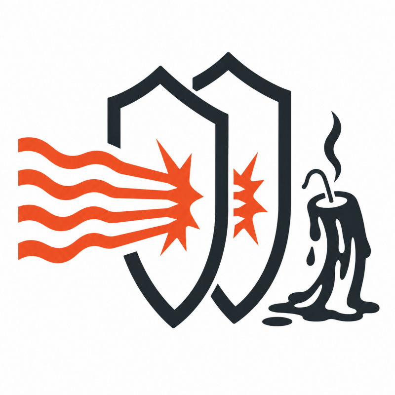

<p align="center"></p>

# hben — HTTP Benchmark

hben exposes chokepoints in multi-tiered web apps by sending adapted request patterns and measuring how the stack degrades under pressure. It's more app-aware than raw flood tools like `ab` or `siege` — which only tell you requests per second — and far more compact than full-blown testing suites.

**Key features:**

- **High concurrency from a single sender** — hundreds of goroutines from one machine
- **Adaptive backoff** — detects failures and steps back to sustain pressure rather than flooding a downed server
- **Acceptable/unacceptable classification** — responses during sustain are measured against a baseline, giving you a human-readable pass/fail percentage instead of raw latency numbers
- **Lanehog mode** — occupies upstream connections (PHP-FPM, Apache workers) with minimal bandwidth, using best-effort techniques to bypass nginx buffering and reach non-scalable backends directly

## Install

**Binary** — Download from [GitHub Releases](https://github.com/antradar/hben/releases).

**APT** (Debian/Ubuntu):

```bash
curl -1sLf https://www.antradar.com/hben/apt/gpg.key | sudo tee /etc/apt/trusted.gpg.d/hben.asc
echo 'deb [signed-by=/etc/apt/trusted.gpg.d/hben.asc] https://www.antradar.com/hben/apt/ ./' | sudo tee /etc/apt/sources.list.d/hben.list
sudo apt-get update
sudo apt-get install hben
```

**Go install**:

```bash
go install github.com/antradar/hben@latest
```

## Quick start

```bash
hben -url https://example.com/
```

This runs 5 probe requests, ramps to 5 concurrent workers over 10 seconds, then sustains peak load for 30 seconds. Lanehog workers are enabled by default (25% of max concurrency).

## How it works

hben runs in three phases:

1. **Probe** — Sends sequential requests to establish a baseline response time
2. **Ramp** — Gradually increases concurrency from 1 to the target, stepping up at intervals
3. **Sustain** — Holds peak concurrency for the configured duration, with adaptive backoff on consecutive failures

Workers that hit `backoff-threshold` consecutive 5xx/timeout responses pause for `backoff-cooldown` before resuming. This avoids flooding a downed server and instead sustains measurable pressure — which is more revealing than a flat flood that just gets 500s back.

The final report classifies **sustain-phase** responses as acceptable or unacceptable. A response is unacceptable if it exceeds `max(baseline × slow-threshold, slow-min)`. The goal is 100% acceptable during sustain.

## Lanehog

Lanehog workers occupy upstream connections (PHP-FPM, Apache workers, etc.) without contributing to stats. Their impact shows indirectly — regular workers slow down because fewer server resources are available.

Servers that can't drain their worker queues quickly exhibit **tail amplification** — they continue struggling long after the traffic stops because backlogged requests are still being processed. Apache + mod_php is especially susceptible: each worker is a PHP process embedded in Apache, so occupied workers can't be recycled until Apache reaps them. nginx + PHP-FPM handles this better since FPM manages its own pool and can recycle workers per-request. Lanehog is designed to expose exactly this kind of structural weakness.

Two modes:

- **GET** (default) — Sends repeated GET requests. Effective against servers where each request ties up an upstream process (e.g., Apache + mod_php).
- **POST** — Sends a request body in small chunks with delays between each chunk. Only effective when nginx streams the body directly to upstream (`proxy_request_buffering off`). hben probes POST acceptance before starting and falls back to GET if the server rejects it.

You can verify lanehog is holding upstream connections from the server side:

```bash
# Count Apache worker connections (adjust port to your upstream)
ss -tn state established '( dport = :8080 or sport = :8080 )' | wc -l

# Count PHP-FPM connections
ss -tn state established '( dport = :9000 or sport = :9000 )' | wc -l
```

hben is designed for benchmarking servers you own or have authorization to test. Unauthorized use against third-party systems may violate laws and terms of service.

```bash
# Default: 25% of max-concurrency as lanehog workers (GET mode)
hben -url https://example.com/

# Explicit lanehog count
hben -url https://example.com/ -lanehog-count 10

# Slow POST mode (for proxy_request_buffering off)
hben -url https://example.com/ -lanehog-mode post

# Disable lanehog entirely
hben -url https://example.com/ -lanehog-count 0
```

## Testing behind a CDN

CDN services like Cloudflare and Bunny.net sit in front of the origin server. To benchmark the server itself — not the CDN — add the origin's IP address to your hosts file:

```bash
# /etc/hosts
1.2.3.4  yourdomain.com
```

As an authorized owner of the target, you know the real IP address. This bypasses the CDN entirely and gives you a direct measurement of your server's capacity.

## Tarpit detection

CDN and WAF services can detect automated traffic and respond by deliberately delaying responses instead of blocking them — a tactic called tarpitting. The request still succeeds (HTTP 200) but takes far longer than the server's actual capacity would explain. This skews benchmark results by inflating response times with CDN-imposed delays that have nothing to do with server performance.

hben's tarpit detection (disabled by default, enable with `-tarpit-threshold`) identifies responses that exceed a multiple of the baseline — typically 10x — and classifies them as CDN throttling rather than server slowness. When detected, the worker backs off for 30 seconds to let the CDN's rate limit counter decay, and the response is excluded from the acceptable/unacceptable stats.

Tarpit detection is primarily intended for identifying misuse of the tool itself — if someone runs hben without authorization, the CDN's tarpit defense will be triggered and the results will clearly show it.

```bash
# Enable tarpit detection (responses >10x baseline)
hben -url https://example.com/ -tarpit-threshold 10
```

## Flags

| Flag | Default | Description |
|------|---------|-------------|
| `-url` | *(required)* | Target URL |
| `-max-concurrency` | 5 | Peak concurrent goroutines |
| `-probe-count` | 5 | Sequential requests in probe phase |
| `-probe-interval` | 2s | Delay between probe requests |
| `-ramp-steps` | 5 | Number of concurrency increments during ramp |
| `-ramp-duration` | 10s | Total ramp phase duration |
| `-sustain-duration` | 30s | Duration to sustain peak load |
| `-timeout` | 30s | Per-request HTTP timeout |
| `-backoff-threshold` | 3 | Consecutive 5xx/timeout before backing off |
| `-backoff-cooldown` | 2s | Pause duration when backoff triggered |
| `-slow-threshold` | 3.0 | Multiplier of baseline for unacceptable responses |
| `-slow-min` | 50ms | Minimum absolute threshold for unacceptable responses |
| `-tarpit-threshold` | 0 | Enable tarpit detection: multiplier of baseline (0=disabled) |
| `-lanehog-count` | -1 | Lanehog workers (-1=auto 25%, 0=disabled) |
| `-lanehog-mode` | get | Lanehog mode: `get` or `post` |
| `-lanehog-body-size` | 2048 | POST body size in bytes |
| `-lanehog-chunk-size` | 32 | Bytes per chunk (POST mode) |
| `-lanehog-chunk-delay` | 500ms | Delay between chunks (POST mode) |
| `-lanehog-verbose` | false | Print per-request lanehog output |
| `-no-banner` | false | Remove hben branding from User-Agent |
| `-rotate-ua` | false | Rotate User-Agent per request (implies -no-banner) |
| `-user-agent` | *(branded)* | Override User-Agent string |

## Understanding the report

```
═══════════════════════════════════════════════════════
  HBEN REPORT
═══════════════════════════════════════════════════════
  Total requests:   347
  Acceptable:       285/300  (95.0%)  [threshold: 3.0x baseline = 0.660s]
  Unacceptable:     15/300  (5.0%)
  HTTP failures:    12
  Backoff events:   2
  Tarpit responses: 8  (excluded from stats, CDN throttling detected)
  Peak concurrency: 5
  Lanehog workers:  5  (not counted in stats)
```

- **Acceptable/Unacceptable** — Counted during sustain phase only. A response is unacceptable if it exceeds the threshold (`max(baseline × slow-threshold, slow-min)`).
- **HTTP failures** — Responses with status codes outside 200–399.
- **Backoff events** — Times a worker paused after hitting the consecutive failure threshold.
- **Tarpit responses** — Responses exceeding the tarpit threshold, excluded from acceptable/unacceptable counts. Indicates CDN-level throttling, not server capacity.
- **Lanehog workers** — Not counted in stats. Their effect is implicit in the regular workers' response times.

Each phase (probe, ramp, sustain) shows its own p50/p95/p99/max latencies and acceptable percentage.

## License

[MIT](LICENSE) — Antradar Software Inc.